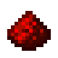
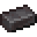
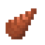
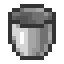
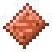

# Before Modern Industrialization

Modern Industrialization 2.5.8, All the Mods 10 8.2.

Stage 1 starts from empty hands, so you can skip this page. Still, a
villager, a few bees and a stock of ore all take time to get going, and in
ATM10 you can have them running before your first boiler.

## 1. Forge Hammer

Make a **Forge Hammer**. The villager needs it as a workstation, and it also
presses the plates and bolts for the drill.

<!-- mc:card stage-00-hammer modern_industrialization:forge_hammer -->

Crafting Table

<!-- /mc -->

## 2. The industrialist villager

The industrialist sells for emeralds the parts that are slow to make in the
steam age: gears, rotors, steel, and at the top level an **Analog Circuit**
and a **Motor**.

Find a villager with no profession and pick it up with Shift and right
click; Easy Villagers in ATM10 lets you do that. Make a **Trader**, put the
villager and a **Forge Hammer** inside, and the villager becomes an
industrialist.

<!-- mc:card stage-00-trader easy_villagers:trader -->

Crafting Table

<!-- /mc -->

You trade with it by hand, like with any villager. Trades restock after a
random wait of 1 to 3 minutes.

| Level | Item | Emeralds | Count |
|---|---|---|---|
| 1 | Fire Clay Brick | 2 | 6 |
| 1 | Steel Hammer | 8 | 1 |
| 1 | Copper Ingot | 4 | 8 |
| 1 | Tin Ingot | 4 | 3 |
| 2 | Copper Gear | 4 | 1 |
| 2 | Copper Rotor | 4 | 1 |
| 2 | Bronze Ingot | 4 | 3 |
| 2 | Rubber Sheet | 1 | 6 |
| 3 | Bronze Gear | 4 | 1 |
| 3 | Bronze Rotor | 4 | 1 |
| 3 | Steel Ingot | 6 | 3 |
| 4 | Steel Gear | 5 | 1 |
| 4 | Steel Plate | 6 | 3 |
| 4 | Steel Upgrade | 20 | 1 |
| 5 | Analog Circuit | 12 | 1 |
| 5 | Motor | 8 | 2 |
| 5 | Bronze Drill | 18 | 4 |

The stage pages point out, next to the step that needs one of these parts,
what it costs at the villager.

??? note "Can it trade on its own?"
    Yes, once you have a **Netherite Ingot**: an **Auto Trader** trades by
    itself, one trade every 1 second. Its trades restock the same way, after
    1 to 3 minutes.

    <!-- mc:card stage-00-auto-trader easy_villagers:auto_trader -->
    
Crafting Table

    <!-- /mc -->

## 3. Steam Mining Drill

The drill mines a 3 by 3 square and has Silk Touch on from the start, so
ores drop as blocks. It takes 17 **Iron Ingot**, 17 **Copper Ingot** and 3
**Diamond**. Press the plates, bolts, rod and curved plates on the **Forge
Hammer** with no tool in it.

<!-- mc:card stage-00-drill modern_industrialization:steam_mining_drill -->

Crafting Table

<!-- /mc -->

<!-- mc:card stage-00-drill modern_industrialization:copper_drill_head -->

Crafting Table

<!-- /mc -->

<!-- mc:card stage-00-drill modern_industrialization:iron_large_plate -->

Crafting Table2 times

<!-- /mc -->

Right click on water to fill the tank. Any furnace fuel works; drop it onto
the drill in your inventory. A full tank lasts 3 minutes of burning, one
**Coal** burns for 16 seconds, and the drill keeps burning fuel even while
you are not mining. Shift and right click turn Silk Touch off. Hold Shift
while mining to break a single block 4 times faster. It harvests anything a
diamond pickaxe can.

## 4. Where to find MI ores

Tin, lead, nickel, silver and aluminum come from AllTheOres in ATM10. Their
ores spawn in every world and MI machines take them. MI has three ores of
its own in the Overworld, all from the bottom of the world up to the height
below.

| Ore | Up to height | Veins per chunk | Blocks per vein |
|---|---|---|---|
| Antimony Ore | 64 | 20 | 5 |
| Tungsten Ore | 20 | 6 | 5 |
| Monazite Ore | 24 | 2 | 3 |

There is no **Titanium Ore** in the Overworld at all. You find it in the
ATM mining dimension, above height 65. The same dimension has more
**Monazite Ore**, 10 veins per chunk instead of 2, plus tungsten, antimony
and iridium. A **Teleport Pad** takes you there; it is made from 4
**Allthemodium Nugget** and an **Ender Pearl**, and **Allthemodium Ore**
needs a netherite pickaxe.

Keep any tungsten ore you find: the guide turns it into ingots in stage 7.
If you already run an **Arc Furnace** from Immersive Engineering, it smelts
**Raw Tungsten** earlier; stage 7 has the details.

## 5. Bees

Three Productive Bees bees can be set up before MI. You will want what they
make later on: sulfur, monazite and oil.

Sulfur Bee. Make a **Nether Brick Nest** from an **Iron Sword** and **Nether
Bricks**, place it in the Nether and use **Magma Cream** on it; a Magmatic
Bee comes out. Leafcutter Bees live in a **Dirt Nest** in the Overworld, and
you can craft that nest too, from **Coarse Dirt** and a wooden sword.
Magmatic Bee with Leafcutter Bee gives a Coal Bee, and Coal Bee with
Magmatic Bee gives a Sulfur Bee. Its flower is **Coal Ore**.

Monazite Bee. Make a **Block of Monazite** from 9 **Monazite Dust**; monazite
ore drops dust right away. Right click a Sulfur Bee with the block and it
turns into a Monazite Bee, which also uses that block as its flower. Its comb
gives **Monazite Dust** 80 % of the time.

Oily Bee is a fishing catch in deep ocean: about 10 % of catches, around 23
% with Luck of the Sea III. Its flower is **Crude Oil**, and PneumaticCraft
oil lakes spawn in the world. One comb gives 50 mB of the mod's **Crude
Oil**.

The other bees for MI need the mod's machines for their eggs or a metal
block as a flower; they get notes in stages 5, 6 and 7.

## 6. Stock up on silicon

If you already have AE2 or Mekanism, stock up on **Silicon**: a Mekanism
**Crusher** makes it from any sand. Nine **Silicon** craft a **Block of
Silicon**, and in stage 2 a **Steel Unpacker** splits the block into 9 of
the mod's **Silicon Ingot**, no Electric Blast Furnace needed.

??? note "Bronze without copper dust"
    If a Mekanism **Metallurgic Infuser** is already running, it makes 4
    **Bronze Ingot** from 3 **Copper Ingot** and tin: one **Tin Dust** gives
    10 units of tin and the alloy takes 10. The stage 1 route does not need
    it.

??? note "What about the Digital Miner?"
    In ATM10 the Mekanism **Digital Miner** comes late: it takes 2
    **Vibranium Ingot** and 2 **Teleportation Core**. Once you have one, it
    digs the ores and blocks MI needs straight out of the world: it mines
    only what its filters allow, within a radius of up to 32 blocks, one
    block every 4 seconds without upgrades.
