# Stage 1. Steam and bronze

Modern Industrialization 2.4.2, modpack All the Mods 10 To the Sky 2.0.1.

By the end of this stage you will have a **Bronze Boiler**, and its steam
will run four machines: **Bronze Furnace**, **Bronze Macerator**, **Bronze
Compressor** and **Bronze Mixer**. Everything is made by hand at the
crafting table, in a furnace and on the **Forge Hammer**.

## What you need

- 8 **Copper Ore** and 4 **Deepslate Tin Ore**
- 81 **Iron Ingot**: 21 go into parts, 60 into 2 **Iron Hammer**
- 2 **Diamond**
- 3 **Glass** and 1 **Glass Pane**
- 16 each of **Brick**, **Clay Ball** and **Cobblestone**
- 4 **Stick** for the hammers
- 16 **Coal** for smelting, then more coal for the boiler
- a regular **Furnace** for smelting and a **Bucket** for water

There is no ore in an ATM10SKY world. Copper and tin come from the Ex Deorum
sieve: **Gravel** through an **Iron Mesh** drops ore chunks, and 4 chunks
make a block of ore at the crafting table. **Diamond** drops from the same
sieve. **Clay Ball** comes from a **Clay** block, which an Ex Deorum barrel
makes out of **Dust** and water. Smelting is the slowest part of the stage:
126 smelts of 10 seconds each, about 21 minutes in one regular furnace.

### Stage tree

Everything you need, from raw materials to machines. Hover over an item to
see its recipe and its branch.

<!-- mc:tree stage-01-gate -->
[{ .mc-tree-img style="max-width:100%;max-height:none" }](../assets/gen/en/stage-01-gate.svg){ .mc-tree-link }
<!-- /mc -->

## 1. Forge Hammer

Make a **Forge Hammer** from 3 **Heavy Weighted Pressure Plate** and 4 **Iron
Ingot**, 10 iron in total. Place it down: all the forging on this stage is
done on it. You will need a second one later, since it is part of the
**Bronze Compressor** recipe.

<!-- mc:card stage-01-gate minecraft:heavy_weighted_pressure_plate -->

Crafting Table6 times

<!-- /mc -->
<!-- mc:card stage-01-gate modern_industrialization:forge_hammer -->

Crafting Table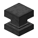2 times

<!-- /mc -->

## 2. Iron Hammer

With no hammer inside, the **Forge Hammer** turns two **Iron Ingot** into one
**Iron Plate**. Make 20 plates this way, craft them into 5 **Iron Large
Plate**, and those into an **Iron Hammer**.

<!-- mc:card stage-01-hammer alltheores:iron_plate -->

Forge Hammer220 times

<!-- /mc -->
<!-- mc:card stage-01-hammer modern_industrialization:iron_large_plate -->

Crafting Table5 times

<!-- /mc -->
<!-- mc:card stage-01-hammer modern_industrialization:iron_hammer -->

Crafting Table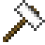

<!-- /mc -->

Put the hammer into the **Forge Hammer**. With a hammer in the slot, forging
yields more, and some recipes only work with it. It has to be the Modern
Industrialization hammer: Ex Deorum has its own **Iron Hammer** for crushing
blocks, but that one does not fit into the **Forge Hammer**. Forging wears the
hammer down. An **Iron Hammer** has 1,666 durability, and one will not last
the whole stage. While the first hammer still has more than 400 left, make
20 **Iron Plate** for the second one: with a hammer, a plate takes a single
ingot, so that is 20 **Iron Ingot** and exactly 400 durability.

!!! tip "Steel Hammer from a villager"
    A villager with the industrialist profession can sell a **Steel Hammer**
    as early as level 1, 8 emeralds for 1 hammer. It has 4,333 durability,
    enough for the whole stage, and you can skip both **Iron Hammer** crafts.
    An unemployed villager becomes an industrialist next to a **Forge
    Hammer**. In skyblock the easiest villager to get is a zombie villager
    from a mob farm, cured.

    A level has 5 trades, and the villager gets 2 of them at random, so not
    every industrialist sells the hammer. If yours does not, and you have not
    traded with it yet, break the **Forge Hammer** and place it again: the
    trades are rolled anew.

    

??? note "Can I do it without a hammer?"
    You can, but it takes more than three times the ore: 28 **Copper Ore**
    and 14 **Deepslate Tin Ore**, and 296 smelts. You will also need 48
    **Brick**, though only 21 iron.

    This guide does not use the alltheores hammers crafted at the crafting
    table. They lose durability with every craft, and autocrafting with them
    in AE2 is hard to set up.

??? info "In plain MI"
    Copper and tin ore generate in the world and mine into **Raw Copper** and
    **Raw Tin**. The stage takes 90 **Raw Copper** and 18 **Raw Tin**, three
    hammers and 80 **Iron Ingot** for them. **Bronze Dust** at the crafting
    table gives 3 from 4 dusts there, and gears are made from plates, bolts
    and a ring.

## 3. Copper and tin dust

Put **Copper Ore** into the **Forge Hammer**: with the hammer, one block of
ore gives 12 **Copper Dust**. Repeat 8 times. **Deepslate Tin Ore** gives 4
**Tin Dust** per block, and you need 4 blocks.

<!-- mc:card stage-01-gate alltheores:copper_dust -->

Forge Hammer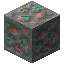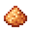12Tool: Iron Hammer8 times

<!-- /mc -->
<!-- mc:card stage-01-gate alltheores:tin_dust -->

Forge Hammer4Tool: Iron Hammer4 times

<!-- /mc -->

## 4. Bronze

**Bronze Dust** is made at the crafting table: 3 **Copper Dust** and 1 **Tin
Dust** give 4 dust. That is 15 crafts for 60 **Bronze Dust**.

<!-- mc:card stage-01-gate alltheores:bronze_dust -->

Crafting Table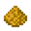415 times

<!-- /mc -->

Smelt all 60 **Bronze Dust** into **Bronze Ingot**. Another 42 **Copper Dust**
goes into the furnace as well, for 42 **Copper Ingot**. A bit of copper dust
stays in reserve.

??? note "How to smelt faster"
    A **Blast Furnace** smelts all the dust of this stage in 5 seconds instead
    of 10, so smelting takes about 10 minutes instead of 21. It is crafted from
    5 **Iron Ingot**, a **Furnace** and 3 **Smooth Stone**. A second regular
    **Furnace** next to the first gives the same gain with no iron at all.

!!! tip "Ingots from a villager"
    An industrialist can sell **Copper Ingot** at level 1, 8 for 4 emeralds.
    **Bronze Ingot** shows up at level 2, 3 for 4 emeralds.

<!-- mc:card stage-01-gate alltheores:bronze_ingot -->

Furnace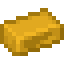60 times

<!-- /mc -->
<!-- mc:card stage-01-gate minecraft:copper_ingot -->

Furnace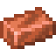42 times

<!-- /mc -->

## 5. Parts on the Forge Hammer

From two ingots the **Forge Hammer** makes a Double Ingot, and no hammer is
needed for that. Make 24 **Bronze Double Ingot** and 9 **Copper Double
Ingot**. A double ingot spares the hammer: it gives just as many parts but
costs less durability, half as much for plates and rods. Keep the other 12
**Bronze Ingot** and 24 **Copper Ingot** aside for the gears.

<!-- mc:card stage-01-gate modern_industrialization:bronze_double_ingot -->

Forge Hammer2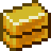24 times

<!-- /mc -->
<!-- mc:card stage-01-gate modern_industrialization:copper_double_ingot -->

Forge Hammer2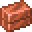9 times

<!-- /mc -->

Then, with the hammer in its slot:

| From | Makes | Times | Output |
|---|---|---|---|
| Bronze Double Ingot | Bronze Plate | 21 | 42 |
| Bronze Double Ingot | Bronze Curved Plate | 3 | 6 |
| Copper Double Ingot | Copper Curved Plate | 4 | 8 |
| Copper Double Ingot | Copper Rod | 2 | 8 |
| Copper Double Ingot | Copper Bolt | 2 | 16 |
| Copper Double Ingot | Copper Ring | 1 | 4 |

<!-- mc:card stage-01-gate alltheores:bronze_plate -->

Forge Hammer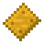2Tool: Iron Hammer21 times

<!-- /mc -->
<!-- mc:card stage-01-gate modern_industrialization:bronze_curved_plate -->

Forge Hammer2Tool: Iron Hammer3 times

<!-- /mc -->
<!-- mc:card stage-01-gate modern_industrialization:copper_curved_plate -->

Forge Hammer2Tool: Iron Hammer4 times

<!-- /mc -->
<!-- mc:card stage-01-gate alltheores:copper_rod -->

Forge Hammer4Tool: Iron Hammer2 times

<!-- /mc -->
<!-- mc:card stage-01-gate modern_industrialization:copper_bolt -->

Forge Hammer8Tool: Iron Hammer2 times

<!-- /mc -->
<!-- mc:card stage-01-gate modern_industrialization:copper_ring -->

Forge Hammer4Tool: Iron Hammer

<!-- /mc -->

## 6. Gears, rotors and pipes

In ATM10SKY gears are crafted at the crafting table from 4 ingots and an
**Iron Nugget**. Make 3 **Bronze Gear** and 6 **Copper Gear**; the nuggets
come from 1 **Iron Ingot**.

<!-- mc:card stage-01-gate alltheores:bronze_gear -->

Crafting Table3 times

<!-- /mc -->
<!-- mc:card stage-01-gate alltheores:copper_gear -->

Crafting Table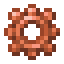6 times

<!-- /mc -->

Two **Copper Curved Plate** and a **Copper Rod** give 4 **Copper Blade**, and
you need 16 of them. A **Copper Rotor** takes 4 **Copper Bolt**, 4 **Copper
Blade** and a **Copper Ring**. Make 4 rotors.

<!-- mc:card stage-01-gate modern_industrialization:copper_blade -->

Crafting Table44 times

<!-- /mc -->
<!-- mc:card stage-01-gate modern_industrialization:copper_rotor -->

Crafting Table4 times

<!-- /mc -->

!!! tip "Gears and rotors from a villager"
    A level 2 industrialist can sell **Copper Gear** and **Copper Rotor**, 1
    for 4 emeralds each. **Bronze Gear** comes at level 3, also 1 for 4.

A single **Fluid Pipe** craft gives 16 pipes. The machines need 9, and the
rest will come in handy at the end.

<!-- mc:card stage-01-gate modern_industrialization:fluid_pipe -->

Crafting Table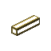16

<!-- /mc -->

## 7. Fire Clay Bricks

The boiler and the **Bronze Furnace** need 3 **Fire Clay Bricks** each. Start
with 16 **Brick**: the **Forge Hammer** with a hammer turns them into 16
**Brick Dust**. At the crafting table 2 **Clay Ball** and 2 **Brick Dust**
give 3 **Fire Clay Dust**. Do that 8 times and smelt all 24 dust into **Fire
Clay Brick**. One block takes 4 of these bricks, and you need 6 blocks.

!!! tip "Fire Clay Brick from a villager"
    A level 1 industrialist can sell 6 **Fire Clay Brick** for 2 emeralds.

<!-- mc:card stage-01-gate modern_industrialization:brick_dust -->

Forge Hammer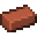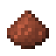Tool: Iron Hammer16 times

<!-- /mc -->
<!-- mc:card stage-01-gate modern_industrialization:fire_clay_dust -->

Crafting Table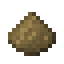38 times

<!-- /mc -->
<!-- mc:card stage-01-gate modern_industrialization:fire_clay_brick -->

Furnace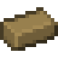24 times

<!-- /mc -->
<!-- mc:card stage-01-gate modern_industrialization:fire_clay_bricks -->

Crafting Table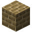6 times

<!-- /mc -->

## 8. Casings and tank

A **Bronze Machine Casing** takes 8 **Bronze Plate** and a **Bronze Gear**.
You need 3, one for each machine except the **Bronze Furnace**. A **Bronze
Tank** made of 8 **Bronze Plate** and **Glass** goes into the boiler. Also make
2 regular **Furnace** from **Cobblestone**, for the boiler and the **Bronze
Furnace**.

<!-- mc:card stage-01-gate modern_industrialization:bronze_machine_casing -->

Crafting Table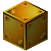3 times

<!-- /mc -->
<!-- mc:card stage-01-gate modern_industrialization:bronze_tank -->

Crafting Table<span title="Glass (Minecraft). Any of: Glass, Connecting Glass, Clear Glass, Scratched Glass, Tiled Glass, Framed Glass, Horizontal Framed Glass, Vertical Framed Glass, Deorum Glass, Runic Glass, Glass Viewer, Silicon Glass Viewer, Dire Glass Viewer, Glowing Glass Viewer, Reinforced Glass Viewer, White Stained Glass, Orange Stained Glass, Magenta Stained Glass, Light Blue Stained Glass, Yellow Stained Glass, Lime Stained Glass, Pink Stained Glass, Gray Stained Glass, Light Gray Stained Glass, Cyan Stained Glass, Purple Stained Glass, Blue Stained Glass, Brown Stained Glass, Green Stained Glass, Red Stained Glass, Black Stained Glass, Connecting Cyan Stained Glass, Connecting Orange Stained Glass, Scratched Light Blue Stained Glass, Connecting Pink Stained Glass, Clear Red Stained Glass, Clear Pink Stained Glass, Scratched Pink Stained Glass, Scratched Purple Stained Glass, Connecting Blue Stained Glass, Connecting Purple Stained Glass, Scratched Brown Stained Glass, Scratched Gray Stained Glass, Clear Yellow Stained Glass, Clear Black Stained Glass, Scratched Red Stained Glass, Clear Gray Stained Glass, Connecting Green Stained Glass, Clear Cyan Stained Glass, Scratched White Stained Glass, Scratched Blue Stained Glass, Clear Blue Stained Glass, Clear Light Gray Stained Glass, Connecting Black Stained Glass, Scratched Yellow Stained Glass, Connecting Light Blue Stained Glass, Connecting Red Stained Glass, Scratched Lime Stained Glass, Clear Orange Stained Glass, Connecting White Stained Glass, Clear Green Stained Glass, Connecting Lime Stained Glass, Connecting Brown Stained Glass, Connecting Yellow Stained Glass, Clear Lime Stained Glass, Scratched Light Gray Stained Glass, Clear Magenta Stained Glass, Scratched Orange Stained Glass, Connecting Light Gray Stained Glass, Clear White Stained Glass, Scratched Green Stained Glass, Scratched Magenta Stained Glass, Scratched Cyan Stained Glass, Scratched Black Stained Glass, Clear Purple Stained Glass, Connecting Gray Stained Glass, Clear Light Blue Stained Glass, Connecting Magenta Stained Glass, Clear Brown Stained Glass, Tinted Glass, Connecting Tinted Blue Stained Glass, Connecting Tinted Lime Stained Glass, Connecting Tinted Magenta Stained Glass, Connecting Tinted Glass, Connecting Tinted Pink Stained Glass, Connecting Tinted Brown Stained Glass, Connecting Tinted Green Stained Glass, Connecting Tinted Yellow Stained Glass, Connecting Tinted Orange Stained Glass, Connecting Tinted Red Stained Glass, Connecting Tinted Cyan Stained Glass, Connecting Tinted Light Gray Stained Glass, Connecting Tinted Light Blue Stained Glass, Connecting Tinted Gray Stained Glass, Connecting Tinted Purple Stained Glass, Connecting Tinted White Stained Glass, Connecting Tinted Black Stained Glass, Peach Stained Glass, Aquamarine Stained Glass, Fluorescent Stained Glass, Mint Stained Glass, Maroon Stained Glass, Bubblegum Stained Glass, Lavender Stained Glass, Persimmon Stained Glass, Cherenkov Stained Glass, Amber Stained Glass, Honey Stained Glass, Ultramarine Stained Glass, Spring Green Stained Glass, Rose Stained Glass, Navy Stained Glass, Icy Blue Stained Glass, Wine Stained Glass, Conifer Stained Glass, Coal Tinted Glass, Copper Tinted Glass, Diamond Tinted Glass, Emerald Tinted Glass, Gold Tinted Glass, Iron Tinted Glass, Lapis Tinted Glass, Quartz Tinted Glass, Redstone Tinted Glass, Ancient Debris Tinted Glass, Ruby Tinted Glass, Sapphire Tinted Glass, Topaz Tinted Glass, Zinc Tinted Glass, Uraninite Tinted Glass, Black Quartz Tinted Glass, Monazite Tinted Glass, Aluminum Tinted Glass, Lead Tinted Glass, Nickel Tinted Glass, Osmium Tinted Glass, Platinum Tinted Glass, Silver Tinted Glass, Tin Tinted Glass, Tungsten Tinted Glass, Uranium Tinted Glass, Allthemodium Tinted Glass, Vibranium Tinted Glass, Unobtainium Tinted Glass, Dark Glass Viewer, Dark Phantom Glass Viewer, Quartz Glass, Vibrant Quartz Glass, Crystalix Glass, Clear Crystalix Glass, Bordered Crystalix Glass, Glaxx, Glaxx Variant 1, Glaxx Variant 2, Glaxx Variant 3, Glaxx Variant 4, Glaxx Variant 5, Glaxx Variant 6, Glaxx Variant 7, Glaxx Variant 8, Glaxx Variant 9, Glaxx Variant 10, Glaxx Variant 11, Glaxx Variant 12, Glaxx Variant 13, Glaxx Variant 14, Glaxx Variant 15, Phantom Glass Viewer, Glowing Phantom Glass Viewer, Immortal Glass Viewer, RGB Viewer, Glowing RGB Viewer" style="position:relative;display:block;width:36px;height:36px;box-sizing:border-box;background:#8b8b8b;border:2px solid;border-color:#373737 #fff #fff #373737;padding:0;margin:0">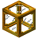

<!-- /mc -->
<!-- mc:card stage-01-gate minecraft:furnace -->

Crafting Table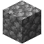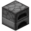2 times

<!-- /mc -->

## 9. Boiler and machines

Build the **Bronze Boiler** and the four machines.

<!-- mc:card stage-01-gate modern_industrialization:bronze_boiler -->

Crafting Table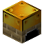

<!-- /mc -->
<!-- mc:card stage-01-gate modern_industrialization:bronze_furnace -->

Crafting Table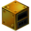

<!-- /mc -->
<!-- mc:card stage-01-gate modern_industrialization:bronze_macerator -->

Crafting Table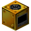

<!-- /mc -->
<!-- mc:card stage-01-gate modern_industrialization:bronze_compressor -->

Crafting Table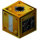

<!-- /mc -->
<!-- mc:card stage-01-gate modern_industrialization:bronze_mixer -->

Crafting Table<span title="Glass (Minecraft). Any of: Glass, Connecting Glass, Clear Glass, Scratched Glass, Tiled Glass, Framed Glass, Horizontal Framed Glass, Vertical Framed Glass, Deorum Glass, Runic Glass, Glass Viewer, Silicon Glass Viewer, Dire Glass Viewer, Glowing Glass Viewer, Reinforced Glass Viewer, White Stained Glass, Orange Stained Glass, Magenta Stained Glass, Light Blue Stained Glass, Yellow Stained Glass, Lime Stained Glass, Pink Stained Glass, Gray Stained Glass, Light Gray Stained Glass, Cyan Stained Glass, Purple Stained Glass, Blue Stained Glass, Brown Stained Glass, Green Stained Glass, Red Stained Glass, Black Stained Glass, Connecting Cyan Stained Glass, Connecting Orange Stained Glass, Scratched Light Blue Stained Glass, Connecting Pink Stained Glass, Clear Red Stained Glass, Clear Pink Stained Glass, Scratched Pink Stained Glass, Scratched Purple Stained Glass, Connecting Blue Stained Glass, Connecting Purple Stained Glass, Scratched Brown Stained Glass, Scratched Gray Stained Glass, Clear Yellow Stained Glass, Clear Black Stained Glass, Scratched Red Stained Glass, Clear Gray Stained Glass, Connecting Green Stained Glass, Clear Cyan Stained Glass, Scratched White Stained Glass, Scratched Blue Stained Glass, Clear Blue Stained Glass, Clear Light Gray Stained Glass, Connecting Black Stained Glass, Scratched Yellow Stained Glass, Connecting Light Blue Stained Glass, Connecting Red Stained Glass, Scratched Lime Stained Glass, Clear Orange Stained Glass, Connecting White Stained Glass, Clear Green Stained Glass, Connecting Lime Stained Glass, Connecting Brown Stained Glass, Connecting Yellow Stained Glass, Clear Lime Stained Glass, Scratched Light Gray Stained Glass, Clear Magenta Stained Glass, Scratched Orange Stained Glass, Connecting Light Gray Stained Glass, Clear White Stained Glass, Scratched Green Stained Glass, Scratched Magenta Stained Glass, Scratched Cyan Stained Glass, Scratched Black Stained Glass, Clear Purple Stained Glass, Connecting Gray Stained Glass, Clear Light Blue Stained Glass, Connecting Magenta Stained Glass, Clear Brown Stained Glass, Tinted Glass, Connecting Tinted Blue Stained Glass, Connecting Tinted Lime Stained Glass, Connecting Tinted Magenta Stained Glass, Connecting Tinted Glass, Connecting Tinted Pink Stained Glass, Connecting Tinted Brown Stained Glass, Connecting Tinted Green Stained Glass, Connecting Tinted Yellow Stained Glass, Connecting Tinted Orange Stained Glass, Connecting Tinted Red Stained Glass, Connecting Tinted Cyan Stained Glass, Connecting Tinted Light Gray Stained Glass, Connecting Tinted Light Blue Stained Glass, Connecting Tinted Gray Stained Glass, Connecting Tinted Purple Stained Glass, Connecting Tinted White Stained Glass, Connecting Tinted Black Stained Glass, Peach Stained Glass, Aquamarine Stained Glass, Fluorescent Stained Glass, Mint Stained Glass, Maroon Stained Glass, Bubblegum Stained Glass, Lavender Stained Glass, Persimmon Stained Glass, Cherenkov Stained Glass, Amber Stained Glass, Honey Stained Glass, Ultramarine Stained Glass, Spring Green Stained Glass, Rose Stained Glass, Navy Stained Glass, Icy Blue Stained Glass, Wine Stained Glass, Conifer Stained Glass, Coal Tinted Glass, Copper Tinted Glass, Diamond Tinted Glass, Emerald Tinted Glass, Gold Tinted Glass, Iron Tinted Glass, Lapis Tinted Glass, Quartz Tinted Glass, Redstone Tinted Glass, Ancient Debris Tinted Glass, Ruby Tinted Glass, Sapphire Tinted Glass, Topaz Tinted Glass, Zinc Tinted Glass, Uraninite Tinted Glass, Black Quartz Tinted Glass, Monazite Tinted Glass, Aluminum Tinted Glass, Lead Tinted Glass, Nickel Tinted Glass, Osmium Tinted Glass, Platinum Tinted Glass, Silver Tinted Glass, Tin Tinted Glass, Tungsten Tinted Glass, Uranium Tinted Glass, Allthemodium Tinted Glass, Vibranium Tinted Glass, Unobtainium Tinted Glass, Dark Glass Viewer, Dark Phantom Glass Viewer, Quartz Glass, Vibrant Quartz Glass, Crystalix Glass, Clear Crystalix Glass, Bordered Crystalix Glass, Glaxx, Glaxx Variant 1, Glaxx Variant 2, Glaxx Variant 3, Glaxx Variant 4, Glaxx Variant 5, Glaxx Variant 6, Glaxx Variant 7, Glaxx Variant 8, Glaxx Variant 9, Glaxx Variant 10, Glaxx Variant 11, Glaxx Variant 12, Glaxx Variant 13, Glaxx Variant 14, Glaxx Variant 15, Phantom Glass Viewer, Glowing Phantom Glass Viewer, Immortal Glass Viewer, RGB Viewer, Glowing RGB Viewer" style="position:relative;display:block;width:36px;height:36px;box-sizing:border-box;background:#8b8b8b;border:2px solid;border-color:#373737 #fff #fff #373737;padding:0;margin:0"><span title="Glass (Minecraft). Any of: Glass, Connecting Glass, Clear Glass, Scratched Glass, Tiled Glass, Framed Glass, Horizontal Framed Glass, Vertical Framed Glass, Deorum Glass, Runic Glass, Glass Viewer, Silicon Glass Viewer, Dire Glass Viewer, Glowing Glass Viewer, Reinforced Glass Viewer, White Stained Glass, Orange Stained Glass, Magenta Stained Glass, Light Blue Stained Glass, Yellow Stained Glass, Lime Stained Glass, Pink Stained Glass, Gray Stained Glass, Light Gray Stained Glass, Cyan Stained Glass, Purple Stained Glass, Blue Stained Glass, Brown Stained Glass, Green Stained Glass, Red Stained Glass, Black Stained Glass, Connecting Cyan Stained Glass, Connecting Orange Stained Glass, Scratched Light Blue Stained Glass, Connecting Pink Stained Glass, Clear Red Stained Glass, Clear Pink Stained Glass, Scratched Pink Stained Glass, Scratched Purple Stained Glass, Connecting Blue Stained Glass, Connecting Purple Stained Glass, Scratched Brown Stained Glass, Scratched Gray Stained Glass, Clear Yellow Stained Glass, Clear Black Stained Glass, Scratched Red Stained Glass, Clear Gray Stained Glass, Connecting Green Stained Glass, Clear Cyan Stained Glass, Scratched White Stained Glass, Scratched Blue Stained Glass, Clear Blue Stained Glass, Clear Light Gray Stained Glass, Connecting Black Stained Glass, Scratched Yellow Stained Glass, Connecting Light Blue Stained Glass, Connecting Red Stained Glass, Scratched Lime Stained Glass, Clear Orange Stained Glass, Connecting White Stained Glass, Clear Green Stained Glass, Connecting Lime Stained Glass, Connecting Brown Stained Glass, Connecting Yellow Stained Glass, Clear Lime Stained Glass, Scratched Light Gray Stained Glass, Clear Magenta Stained Glass, Scratched Orange Stained Glass, Connecting Light Gray Stained Glass, Clear White Stained Glass, Scratched Green Stained Glass, Scratched Magenta Stained Glass, Scratched Cyan Stained Glass, Scratched Black Stained Glass, Clear Purple Stained Glass, Connecting Gray Stained Glass, Clear Light Blue Stained Glass, Connecting Magenta Stained Glass, Clear Brown Stained Glass, Tinted Glass, Connecting Tinted Blue Stained Glass, Connecting Tinted Lime Stained Glass, Connecting Tinted Magenta Stained Glass, Connecting Tinted Glass, Connecting Tinted Pink Stained Glass, Connecting Tinted Brown Stained Glass, Connecting Tinted Green Stained Glass, Connecting Tinted Yellow Stained Glass, Connecting Tinted Orange Stained Glass, Connecting Tinted Red Stained Glass, Connecting Tinted Cyan Stained Glass, Connecting Tinted Light Gray Stained Glass, Connecting Tinted Light Blue Stained Glass, Connecting Tinted Gray Stained Glass, Connecting Tinted Purple Stained Glass, Connecting Tinted White Stained Glass, Connecting Tinted Black Stained Glass, Peach Stained Glass, Aquamarine Stained Glass, Fluorescent Stained Glass, Mint Stained Glass, Maroon Stained Glass, Bubblegum Stained Glass, Lavender Stained Glass, Persimmon Stained Glass, Cherenkov Stained Glass, Amber Stained Glass, Honey Stained Glass, Ultramarine Stained Glass, Spring Green Stained Glass, Rose Stained Glass, Navy Stained Glass, Icy Blue Stained Glass, Wine Stained Glass, Conifer Stained Glass, Coal Tinted Glass, Copper Tinted Glass, Diamond Tinted Glass, Emerald Tinted Glass, Gold Tinted Glass, Iron Tinted Glass, Lapis Tinted Glass, Quartz Tinted Glass, Redstone Tinted Glass, Ancient Debris Tinted Glass, Ruby Tinted Glass, Sapphire Tinted Glass, Topaz Tinted Glass, Zinc Tinted Glass, Uraninite Tinted Glass, Black Quartz Tinted Glass, Monazite Tinted Glass, Aluminum Tinted Glass, Lead Tinted Glass, Nickel Tinted Glass, Osmium Tinted Glass, Platinum Tinted Glass, Silver Tinted Glass, Tin Tinted Glass, Tungsten Tinted Glass, Uranium Tinted Glass, Allthemodium Tinted Glass, Vibranium Tinted Glass, Unobtainium Tinted Glass, Dark Glass Viewer, Dark Phantom Glass Viewer, Quartz Glass, Vibrant Quartz Glass, Crystalix Glass, Clear Crystalix Glass, Bordered Crystalix Glass, Glaxx, Glaxx Variant 1, Glaxx Variant 2, Glaxx Variant 3, Glaxx Variant 4, Glaxx Variant 5, Glaxx Variant 6, Glaxx Variant 7, Glaxx Variant 8, Glaxx Variant 9, Glaxx Variant 10, Glaxx Variant 11, Glaxx Variant 12, Glaxx Variant 13, Glaxx Variant 14, Glaxx Variant 15, Phantom Glass Viewer, Glowing Phantom Glass Viewer, Immortal Glass Viewer, RGB Viewer, Glowing RGB Viewer" style="position:relative;display:block;width:36px;height:36px;box-sizing:border-box;background:#8b8b8b;border:2px solid;border-color:#373737 #fff #fff #373737;padding:0;margin:0">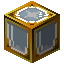

<!-- /mc -->

The boiler pushes steam out on every side by itself, but it is easier to
route it with the leftover **Fluid Pipe**. A pipe does not hook up to a
machine on its own: hold a **Fluid Pipe** and right-click the machine next to
the pipe. The connection appears, and the pipe in your hand is not used up. A
wrench works too, the MI **Wrench** or the wrench from many other mods, but
the stage plan has no wrench in it.

Fill the boiler with water by bucket, the tank holds 8 buckets, and add coal.
Steam starts coming while the boiler heats up, and it reaches full output in
about three minutes, at 1,500 degrees.

At full heat one **Coal** keeps the boiler going for 200 seconds, and a bucket
of water lasts 100. Four running machines burn about 18 coal an hour.

??? note "How to stop carrying water in buckets"
    A **Bronze Water Pump** pumps water by itself and pushes it into the
    machine on its output side. Put water sources next to it, on its sides:
    each gives 1/8 of a bucket every 5 seconds, and one is enough for the
    boiler. The pump itself takes 1 mB of steam per tick, and with it the
    boiler can no longer run all four machines at once.

    <!-- mc:card stage-01-pump modern_industrialization:bronze_water_pump -->
    
Crafting Table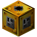

    <!-- /mc -->

??? note "How many machines does one boiler run"
    At full heat the boiler makes 8 mB of steam per tick, and a working bronze
    machine uses 2. Four machines run together; a fifth would wait until one
    of them stops. For a fifth machine, place a second **Bronze Boiler**.

??? note "What about the Bronze Cutting Machine?"
    The modpack quest asks for it in the steam age, but for now it would sit
    idle: every one of its recipes needs **Lubricant**. The **Bronze Mixer**
    makes that from **Redstone Dust** and **Creosote**, and **Creosote** comes
    from the **Coke Oven** of the next stage. Build it there.

??? note "Gunpowder speeds a machine up"
    Right-click a machine with **Gunpowder** and it runs twice as fast for 2
    minutes. A recipe takes the same steam, only faster, at 4 mB per tick, so
    the boiler can carry two such machines. The gunpowder timer keeps running
    even while the machine is idle.

??? note "Compressor before the boiler"
    The mod's guidebook suggests building the **Bronze Compressor** first and
    feeding it steam from buckets: a **Water Bucket** in a furnace turns into a
    **Steam Bucket**. The compressor makes **Bronze Plate** from ingots one to
    one, like the **Forge Hammer** with a hammer, but no hammer wears out.

??? note "Why the Bronze Furnace beats a regular furnace"
    It smelts at the same speed, 10 seconds, but on steam: one **Coal** in the
    boiler gives 80 smelts, and only 8 in a regular furnace.

## Stage complete

All four machines stand by the boiler and run on steam. There are no
precrafts and no AE2 autocrafting on this stage, everything is done by hand.
The next stage is about steel.
