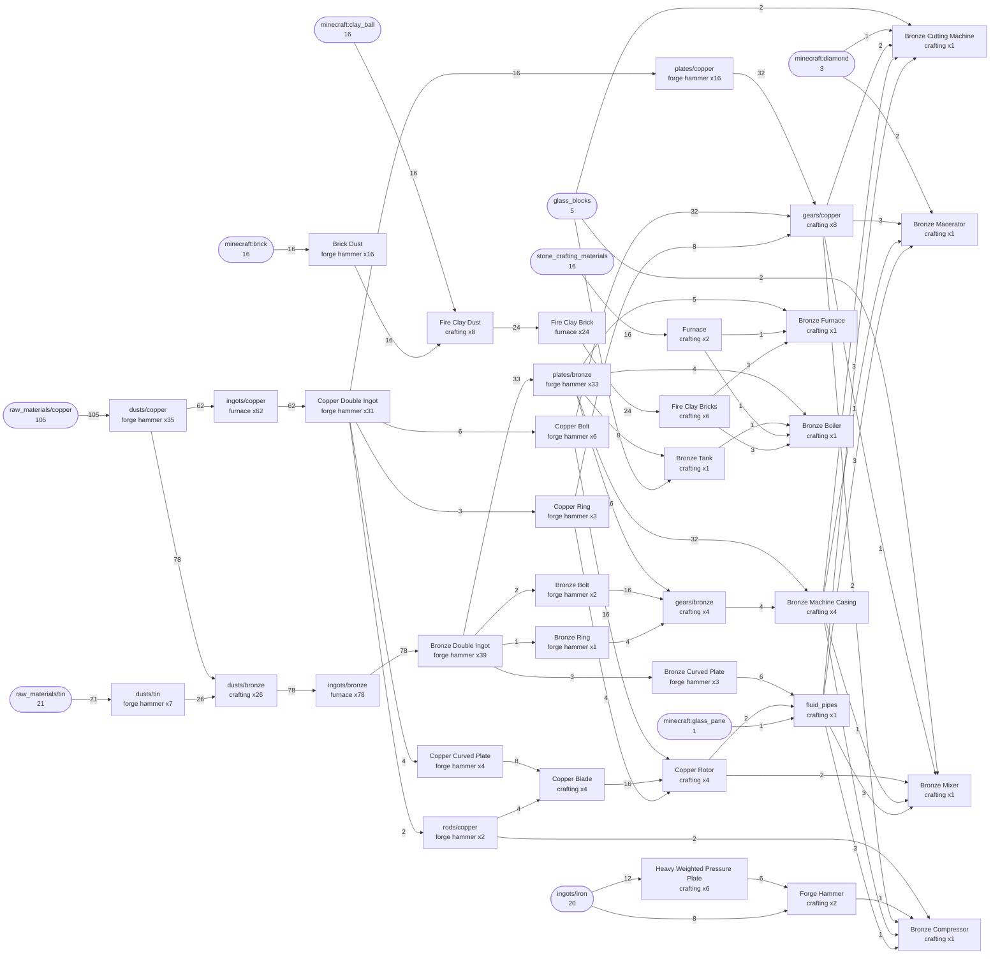

# Этап 1. Пар и бронза

!!! warning "Черновик"
    Числа посчитаны по рецептам мода, в игре ещё не сверены.

!!! info "Откуда числа"
    **[ядро]** — Modern Industrialization 2.4.2 без правок сборки.
    **[слой SKY]** — то, что меняет сборка All the Mods 10 To the Sky (ATM10SKY).
    **[источник]** — книга мода, квесты сборки, видеогайды: из них взята линия
    развития, но не числа. **[не проверено]** — вывод без подтверждения.

## 1. Ворота и вход

Вход — пустые руки: из мода ничего не нужно. Конец этапа — Forge Hammer,
Bronze Boiler и пять бронзовых машин: Bronze Furnace, Bronze Cutting Machine,
Bronze Macerator, Bronze Mixer, Bronze Compressor [ядро; набор — по квесту
сборки]. Какие из них нужны дальше, уточнит этап 2.

### Дерево ворот

Всё, что нужно для ворот, от сырья до машин. Маршрут «двойной слиток» с
молотом, ядро. Число на стрелке — сколько штук уходит, «x N» — сколько раз
выполняется рецепт.

## 2. Машины

Ставятся по одной, линий на этапе нет: книга мода называет паровой век
временным и вкладываться в него не советует [источник: книга MI 2.4.2].

- **Forge Hammer** — два: один стоит, второй уходит в Bronze Compressor [ядро].
- **Bronze Boiler** — один держит четыре бронзовые машины: 8 mB/t пара на
  1500°, машина ест 2 mB/t [ядро]. Пятой машине при одновременной работе
  всех нужен второй бойлер: 9 raw copper, 3 raw tin, 8 brick, 8 clay ball,
  8 камня, 1 glass [ядро, маршрут «двойной слиток»].
- **Бронзовые машины** — base и max 2 EU/t, разгон за счёт efficiency у пара
  ничего не даёт. Время рецепта = eu × duration / 2: Bronze Macerator на raw
  copper (eu 2, 50 т) — 50 т = 2,5 с; Bronze Compressor на plate (eu 2,
  100 т) — 5 с [ядро].
- **Bronze Furnace** — eu 2, duration = время ванильного рецепта: те же
  10 с, что у обычной печи, но 400 mB пара на плавку. Один уголь — 80 плавок
  вместо 8 [ядро].

## 3. Прекрафты

Нет: машины этапа ручные (Forge Hammer работает только через своё окно, без
автоматизации), паровые машины этапа 2 их заменят. Первый прекрафт гайда —
Copper Wire на этапе 2 [источник: видеогайд Arenzale].

## 4. Через AE по запросу

Нет. Развилка «потоком или по запросу» объясняется на этапе 3.

## 5. Ресурсы

Ядро: raw copper — ванильная руда, raw tin — руда мода [ядро]. Сколько уходит
на ворота, зависит от того, ковать ли с молотом. Forge Hammer работает без
инструмента; с Iron Hammer в слоте выход лучше, но молот изнашивается
(прочность 1 666; молот — 5 Iron Large Plate = 20 Iron Plate) [ядро].

| Маршрут, ядро | raw copper | raw tin | Iron Hammer | Iron на молоты |
|---|---|---|---|---|
| без молота | 278 | 52 | 0 | 0 |
| с молотом, из двойных слитков | 105 | 21 | 4 | 100 |

Больше меди — ковать без молота; больше железа — с молотом. Двойной слиток
(2 слитка → 1, без молота) вдвое снижает износ на plate и rod. Медь с
молотом: raw → dust 3 → 4, и пыль в печь — на треть больше металла, чем
плавить raw [ядро]. Общее для обоих маршрутов: 20 iron ingot, 3 diamond,
5 glass, 1 glass pane, 16 clay ball, 16 камня; brick — 16 с молотом, 48 без.

**ATM10SKY.** Руды в мире нет — сырьё даёт сито Ex Deorum (crushed deepslate
и др. → copper / tin ore chunk), позже пчёлы [слой SKY; скорость сита не
посчитана]. Сборка убрала рецепт bronze dust мода на верстаке (3 + 1 → 3),
вместо него рецепт alltheores 3 + 1 → 4; шестерни alltheores — 4 слитка +
iron nugget [слой SKY]. Молоты alltheores на верстаке гайд не советует: они
изнашиваются за каждый крафт, и такой автокрафт трудно настроить.

| Маршрут, слой SKY | raw copper | raw tin | Iron Hammer | Iron на молоты |
|---|---|---|---|---|
| без молота | 162 | 32 | 0 | 0 |
| с молотом, из двойных слитков | 78 | 15 | 2 | 60 |

Steam Quarry — пропустить [источник: видеогайд Arenzale]; в ATM10SKY в нём
antimony вместо zinc [слой SKY].

## 6. Энергия

- Бойлер на угле: 1 coal = 1 600 т горения × 20 = 32 000 mB пара = 200 с
  бронзового бойлера на максимуме [ядро; время горения — NeoForge 21.1.221].
  Четыре машины — 18 угля в час на бойлер; вода 0,5 mB/t (16 mB пара из
  1 mB воды) [ядро].
- Прогрев с нуля до 1500° при полном отборе — 3 905 т (3 мин 15 с); за это
  время бойлер отдаёт 19 232 mB [ядро].
- Топливо в простое не сгорает: пару некуда деться, тепло не уходит. Теряется
  только запас тепла, 12 000 EU, когда бойлер остывает [ядро].
- Gunpowder правым кликом — ×2 к скорости на 2 400 т (2 мин) за штуку; пара
  на рецепт столько же, машина ест 4 mB/t, бойлер держит две такие. Таймер
  идёт и в простое [ядро]. Рецепты eu 3–4 под порохом в бронзовых машинах,
  видимо, запускаются [не проверено].

## 7. Время этапа и узкое место

Ручная часть — верстак и Forge Hammer — не считается: время зависит от
игрока. Считается плавка: ворота — 164 плавки (маршрут «двойной») или 508
(без молота) по 10 с — 27 мин или 85 мин одной обычной печью; угля 20,5 и
63,5 [ядро]. Узкое место — плавка и добыча руды: восемь печей сжимают плавку
до 3,5 и 11 мин [не проверено: печи загружены поровну].

## 8. Проверка в игре

Что замерить и чего ждать:

1. Bronze Boiler с нуля, уголь, четыре машины забирают пар: 1500° через
   ~195 с (3 905 т).
2. Он же на максимуме: один coal держит 8 mB/t ровно 200 с.
3. Bronze Macerator, raw copper: одна штука за 2,5 с; под порохом — 1,25 с.
4. Bronze Furnace: плавка 10 с, 400 mB пара.
5. Ворота на маршруте «двойной»: на руки ушло 105 raw copper и 21 raw tin
   (ядро) или 78 и 15 (ATM10SKY).
