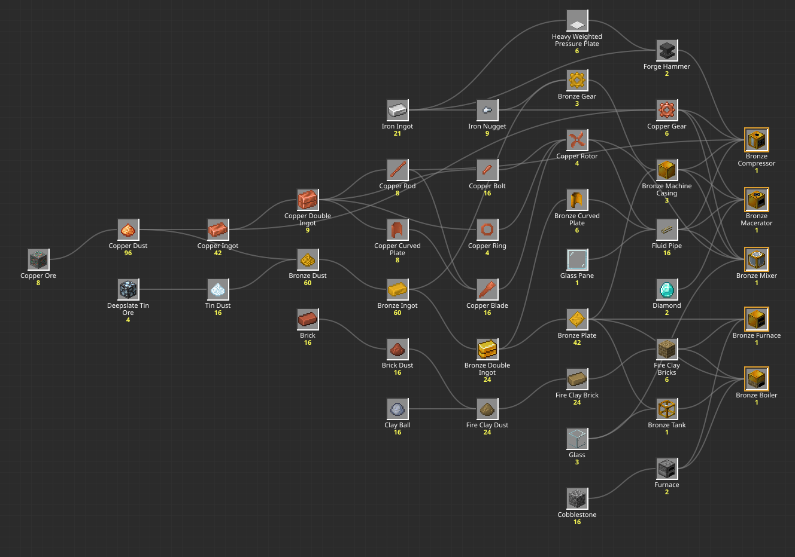
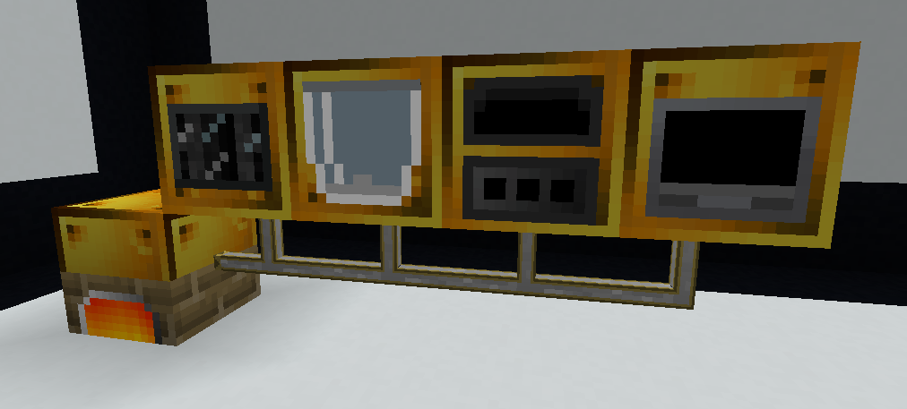

# Этап 1. Пар и бронза

Modern Industrialization 2.4.2, сборка All the Mods 10 To the Sky 2.0.1.

К концу этапа у вас будет **Bronze Boiler**, а от него на паре заработают
четыре машины: **Bronze Furnace**, **Bronze Macerator**, **Bronze
Compressor** и **Bronze Mixer**. Все делается руками на верстаке, в печи и
на **Forge Hammer**.

## Что понадобится

- 8 **Copper Ore** и 4 **Deepslate Tin Ore**
- 81 **Iron Ingot**: 21 уйдет в детали, 60 на два **Iron Hammer**
- 2 **Diamond**
- 3 **Glass** и 1 **Glass Pane**
- по 16 **Brick**, **Clay Ball** и **Cobblestone**
- 4 **Stick** на два молота
- 16 **Coal** на плавку, потом уголь для бойлера
- обычная **Furnace** для плавки и **Bucket** для воды

Руды в мире ATM10SKY нет. Медь и олово дает сито Ex Deorum: **Gravel**
через **Iron Mesh** дает куски руды, из 4 кусков на верстаке собирается
блок. **Diamond** выпадает из того же сита. **Clay Ball** получается из
блока **Clay**, его делает бочка Ex Deorum из **Dust** и воды. Дольше всего
на этапе плавка: 126 плавок по 10 секунд, одной обычной печью это около 21
минуты.

### Дерево этапа

Все, что нужно, от сырья до машин. Наведите на предмет, чтобы увидеть рецепт
и его ветку.

<!-- mc:tree stage-01-gate -->
[{ .mc-tree-img style="max-width:100%;max-height:none" }](../assets/gen/stage-01-gate.svg){ .mc-tree-link }
<!-- /mc -->

## 1. Forge Hammer

Создайте **Forge Hammer** из 3 **Heavy Weighted Pressure Plate** и 4 **Iron
Ingot**, на него уходит 10 железа. Поставьте его, вся ковка этапа пойдет на
нем. Второй такой же понадобится позже: он входит в рецепт **Bronze
Compressor**.

<!-- mc:card stage-01-gate minecraft:heavy_weighted_pressure_plate -->

Crafting Table6 раз

<!-- /mc -->
<!-- mc:card stage-01-gate modern_industrialization:forge_hammer -->

Crafting Table2 раза

<!-- /mc -->

## 2. Iron Hammer

Без молота **Forge Hammer** делает одну **Iron Plate** из двух **Iron Ingot**.
Сделайте на нем так 20 пластин, соберите из них 5 **Iron Large Plate**, а из
них **Iron Hammer**.

<!-- mc:card stage-01-hammer alltheores:iron_plate -->

Forge Hammer220 раз

<!-- /mc -->
<!-- mc:card stage-01-hammer modern_industrialization:iron_large_plate -->

Crafting Table5 раз

<!-- /mc -->
<!-- mc:card stage-01-hammer modern_industrialization:iron_hammer -->

Crafting Table

<!-- /mc -->

Положите молот в **Forge Hammer**. С ним ковка дает больше и открываются
рецепты, которых без молота нет. Молот нужен именно этот, из Modern
Industrialization: у Ex Deorum есть свой **Iron Hammer** для дробления
блоков, но в **Forge Hammer** он не встает. Ковка с молотом снимает
прочность, у **Iron Hammer** ее 1 666, и на весь этап одного не хватит. Пока у первого молота
осталось больше 400, сделайте 20 **Iron Plate** на второй: с молотом пластина
выходит из одного слитка, это 20 **Iron Ingot** и как раз 400 прочности.

!!! tip "Steel Hammer у жителя"
    Житель с профессией industrialist может продавать **Steel Hammer** уже
    на 1 уровне: 8 изумрудов за 1 молот. Прочности у него 4 333, этого
    хватит на весь этап, и оба **Iron Hammer** делать не придется.
    Industrialist получается из безработного жителя, рядом с которым стоит
    **Forge Hammer**. В скайблоке жителя проще всего взять зомби-жителем с
    фермы мобов и вылечить.

    Из 5 сделок уровня житель получает 2 случайные, так что молот есть не у
    каждого. Если его нет, а вы с жителем еще не торговали, сломайте и
    поставьте заново **Forge Hammer**: сделки выпадут заново.

??? note "Можно без молота?"
    Можно, но руды уйдет в три с лишним раза больше: 28 **Copper Ore** и 14
    **Deepslate Tin Ore**, плавок 296. **Brick** тогда нужно 48, а железа
    только 21.

    Молоты alltheores, которые собираются на верстаке, гайд не советует. Они
    теряют прочность на каждом крафте, и автокрафт с ними в AE2 настроить
    трудно.

??? info "В чистом MI"
    Руда меди и олова есть в мире и копается в **Raw Copper** и **Raw Tin**.
    На этап уходит 90 **Raw Copper** и 18 **Raw Tin**, молотов три, на них
    80 **Iron Ingot**. **Bronze Dust** на
    верстаке там выходит 3 штуки из 4 пылей, а шестерни собираются из
    пластин, болтов и кольца.

## 3. Пыль меди и олова

Кладите **Copper Ore** в **Forge Hammer**: с молотом из одного блока руды
выходит 12 **Copper Dust**, повторите 8 раз. **Deepslate Tin Ore** дает по
4 **Tin Dust**, его нужно 4 блока.

<!-- mc:card stage-01-gate alltheores:copper_dust -->

Forge Hammer12Инструмент: Iron Hammer8 раз

<!-- /mc -->
<!-- mc:card stage-01-gate alltheores:tin_dust -->

Forge Hammer4Инструмент: Iron Hammer4 раза

<!-- /mc -->

## 4. Бронза

**Bronze Dust** делается на верстаке: 3 **Copper Dust** и 1 **Tin Dust** дают
4 пыли. Нужно 15 крафтов, 60 **Bronze Dust**.

<!-- mc:card stage-01-gate alltheores:bronze_dust -->

Crafting Table415 раз

<!-- /mc -->

Переплавьте в печи все 60 **Bronze Dust** в **Bronze Ingot**. Еще 42
**Copper Dust** тоже в печь, выйдет 42 **Copper Ingot**. Немного медной пыли
останется в запас.

??? note "Как плавить быстрее"
    **Blast Furnace** плавит всю пыль этапа за 5 секунд вместо 10, и плавка
    займет около 10 минут вместо 21. Она собирается из 5 **Iron Ingot**,
    **Furnace** и 3 **Smooth Stone**. Вторая обычная **Furnace** рядом с
    первой дает тот же выигрыш без железа.

!!! tip "Слитки у жителя"
    Industrialist может продавать **Copper Ingot** на 1 уровне, 8 штук за 4
    изумруда. **Bronze Ingot** появляется на 2 уровне, 3 штуки за 4
    изумруда.

<!-- mc:card stage-01-gate alltheores:bronze_ingot -->

Furnace60 раз

<!-- /mc -->
<!-- mc:card stage-01-gate minecraft:copper_ingot -->

Furnace42 раза

<!-- /mc -->

## 5. Детали на Forge Hammer

Из двух слитков **Forge Hammer** делает Double Ingot, молот для этого не
нужен. Сделайте 24 **Bronze Double Ingot** и 9 **Copper Double Ingot**.
Двойной слиток бережет молот: деталей из него выходит столько же, а прочности
уходит меньше, на пластинах и стержнях вдвое. Остальные 12 **Bronze Ingot** и 24 **Copper Ingot** не
трогайте, они пойдут на шестерни.

<!-- mc:card stage-01-gate modern_industrialization:bronze_double_ingot -->

Forge Hammer224 раза

<!-- /mc -->
<!-- mc:card stage-01-gate modern_industrialization:copper_double_ingot -->

Forge Hammer29 раз

<!-- /mc -->

Дальше с молотом в слоте:

| Из чего | Что | Сколько раз | Выйдет |
|---|---|---|---|
| Bronze Double Ingot | Bronze Plate | 21 | 42 |
| Bronze Double Ingot | Bronze Curved Plate | 3 | 6 |
| Copper Double Ingot | Copper Curved Plate | 4 | 8 |
| Copper Double Ingot | Copper Rod | 2 | 8 |
| Copper Double Ingot | Copper Bolt | 2 | 16 |
| Copper Double Ingot | Copper Ring | 1 | 4 |

<!-- mc:card stage-01-gate alltheores:bronze_plate -->

Forge Hammer2Инструмент: Iron Hammer21 раз

<!-- /mc -->
<!-- mc:card stage-01-gate modern_industrialization:bronze_curved_plate -->

Forge Hammer2Инструмент: Iron Hammer3 раза

<!-- /mc -->
<!-- mc:card stage-01-gate modern_industrialization:copper_curved_plate -->

Forge Hammer2Инструмент: Iron Hammer4 раза

<!-- /mc -->
<!-- mc:card stage-01-gate alltheores:copper_rod -->

Forge Hammer4Инструмент: Iron Hammer2 раза

<!-- /mc -->
<!-- mc:card stage-01-gate modern_industrialization:copper_bolt -->

Forge Hammer8Инструмент: Iron Hammer2 раза

<!-- /mc -->
<!-- mc:card stage-01-gate modern_industrialization:copper_ring -->

Forge Hammer4Инструмент: Iron Hammer

<!-- /mc -->

## 6. Шестерни, роторы и трубы

Шестерни в ATM10SKY собираются на верстаке из 4 слитков и **Iron Nugget**.
Сделайте 3 **Bronze Gear** и 6 **Copper Gear**, нуггеты получите из 1 **Iron
Ingot**.

<!-- mc:card stage-01-gate alltheores:bronze_gear -->

Crafting Table3 раза

<!-- /mc -->
<!-- mc:card stage-01-gate alltheores:copper_gear -->

Crafting Table6 раз

<!-- /mc -->

Из 2 **Copper Curved Plate** и **Copper Rod** выходит 4 **Copper Blade**, всего
их нужно 16. **Copper Rotor** собирается из 4 **Copper Bolt**, 4 **Copper
Blade** и **Copper Ring**, сделайте 4 ротора.

<!-- mc:card stage-01-gate modern_industrialization:copper_blade -->

Crafting Table44 раза

<!-- /mc -->
<!-- mc:card stage-01-gate modern_industrialization:copper_rotor -->

Crafting Table4 раза

<!-- /mc -->

!!! tip "Шестерни и роторы у жителя"
    Industrialist 2 уровня может продавать **Copper Gear** и **Copper Rotor**, по 1
    штуке за 4 изумруда. **Bronze Gear** у него на 3 уровне, тоже 1 за 4.

Один крафт **Fluid Pipe** дает сразу 16 труб. Машинам из них нужно 9,
остальные пригодятся в конце.

<!-- mc:card stage-01-gate modern_industrialization:fluid_pipe -->

Crafting Table16

<!-- /mc -->

## 7. Fire Clay Bricks

Бойлеру и **Bronze Furnace** нужно по 3 **Fire Clay Bricks**. Начните с 16
**Brick**: на **Forge Hammer** с молотом из них выйдет 16 **Brick Dust**. На
верстаке 2 **Clay Ball** и 2 **Brick Dust** дают 3 **Fire Clay Dust**,
сделайте 8 раз и переплавьте все 24 пыли в **Fire Clay Brick**. Из 4 таких
кирпичей собирается один блок, их нужно 6.

!!! tip "Fire Clay Brick у жителя"
    Industrialist на 1 уровне может продавать 6 **Fire Clay Brick** за 2
    изумруда.

<!-- mc:card stage-01-gate modern_industrialization:brick_dust -->

Forge HammerИнструмент: Iron Hammer16 раз

<!-- /mc -->
<!-- mc:card stage-01-gate modern_industrialization:fire_clay_dust -->

Crafting Table38 раз

<!-- /mc -->
<!-- mc:card stage-01-gate modern_industrialization:fire_clay_brick -->

Furnace24 раза

<!-- /mc -->
<!-- mc:card stage-01-gate modern_industrialization:fire_clay_bricks -->

Crafting Table6 раз

<!-- /mc -->

## 8. Корпуса и бак

**Bronze Machine Casing** собирается из 8 **Bronze Plate** и **Bronze Gear**,
нужно 3: по одному на каждую машину, кроме **Bronze Furnace**. **Bronze Tank**
из 8 **Bronze Plate** и **Glass** уйдет в бойлер. Еще создайте 2 обычные
**Furnace** из **Cobblestone**, для бойлера и **Bronze Furnace**.

<!-- mc:card stage-01-gate modern_industrialization:bronze_machine_casing -->

Crafting Table3 раза

<!-- /mc -->
<!-- mc:card stage-01-gate modern_industrialization:bronze_tank -->

Crafting Table<span title="Glass (Minecraft). Подходит любой: Glass, Connecting Glass, Clear Glass, Scratched Glass, Tiled Glass, Framed Glass, Horizontal Framed Glass, Vertical Framed Glass, Deorum Glass, Runic Glass, Glass Viewer, Silicon Glass Viewer, Dire Glass Viewer, Glowing Glass Viewer, Reinforced Glass Viewer, White Stained Glass, Orange Stained Glass, Magenta Stained Glass, Light Blue Stained Glass, Yellow Stained Glass, Lime Stained Glass, Pink Stained Glass, Gray Stained Glass, Light Gray Stained Glass, Cyan Stained Glass, Purple Stained Glass, Blue Stained Glass, Brown Stained Glass, Green Stained Glass, Red Stained Glass, Black Stained Glass, Connecting Cyan Stained Glass, Connecting Orange Stained Glass, Scratched Light Blue Stained Glass, Connecting Pink Stained Glass, Clear Red Stained Glass, Clear Pink Stained Glass, Scratched Pink Stained Glass, Scratched Purple Stained Glass, Connecting Blue Stained Glass, Connecting Purple Stained Glass, Scratched Brown Stained Glass, Scratched Gray Stained Glass, Clear Yellow Stained Glass, Clear Black Stained Glass, Scratched Red Stained Glass, Clear Gray Stained Glass, Connecting Green Stained Glass, Clear Cyan Stained Glass, Scratched White Stained Glass, Scratched Blue Stained Glass, Clear Blue Stained Glass, Clear Light Gray Stained Glass, Connecting Black Stained Glass, Scratched Yellow Stained Glass, Connecting Light Blue Stained Glass, Connecting Red Stained Glass, Scratched Lime Stained Glass, Clear Orange Stained Glass, Connecting White Stained Glass, Clear Green Stained Glass, Connecting Lime Stained Glass, Connecting Brown Stained Glass, Connecting Yellow Stained Glass, Clear Lime Stained Glass, Scratched Light Gray Stained Glass, Clear Magenta Stained Glass, Scratched Orange Stained Glass, Connecting Light Gray Stained Glass, Clear White Stained Glass, Scratched Green Stained Glass, Scratched Magenta Stained Glass, Scratched Cyan Stained Glass, Scratched Black Stained Glass, Clear Purple Stained Glass, Connecting Gray Stained Glass, Clear Light Blue Stained Glass, Connecting Magenta Stained Glass, Clear Brown Stained Glass, Tinted Glass, Connecting Tinted Blue Stained Glass, Connecting Tinted Lime Stained Glass, Connecting Tinted Magenta Stained Glass, Connecting Tinted Glass, Connecting Tinted Pink Stained Glass, Connecting Tinted Brown Stained Glass, Connecting Tinted Green Stained Glass, Connecting Tinted Yellow Stained Glass, Connecting Tinted Orange Stained Glass, Connecting Tinted Red Stained Glass, Connecting Tinted Cyan Stained Glass, Connecting Tinted Light Gray Stained Glass, Connecting Tinted Light Blue Stained Glass, Connecting Tinted Gray Stained Glass, Connecting Tinted Purple Stained Glass, Connecting Tinted White Stained Glass, Connecting Tinted Black Stained Glass, Peach Stained Glass, Aquamarine Stained Glass, Fluorescent Stained Glass, Mint Stained Glass, Maroon Stained Glass, Bubblegum Stained Glass, Lavender Stained Glass, Persimmon Stained Glass, Cherenkov Stained Glass, Amber Stained Glass, Honey Stained Glass, Ultramarine Stained Glass, Spring Green Stained Glass, Rose Stained Glass, Navy Stained Glass, Icy Blue Stained Glass, Wine Stained Glass, Conifer Stained Glass, Coal Tinted Glass, Copper Tinted Glass, Diamond Tinted Glass, Emerald Tinted Glass, Gold Tinted Glass, Iron Tinted Glass, Lapis Tinted Glass, Quartz Tinted Glass, Redstone Tinted Glass, Ancient Debris Tinted Glass, Ruby Tinted Glass, Sapphire Tinted Glass, Topaz Tinted Glass, Zinc Tinted Glass, Uraninite Tinted Glass, Black Quartz Tinted Glass, Monazite Tinted Glass, Aluminum Tinted Glass, Lead Tinted Glass, Nickel Tinted Glass, Osmium Tinted Glass, Platinum Tinted Glass, Silver Tinted Glass, Tin Tinted Glass, Tungsten Tinted Glass, Uranium Tinted Glass, Allthemodium Tinted Glass, Vibranium Tinted Glass, Unobtainium Tinted Glass, Dark Glass Viewer, Dark Phantom Glass Viewer, Quartz Glass, Vibrant Quartz Glass, Crystalix Glass, Clear Crystalix Glass, Bordered Crystalix Glass, Glaxx, Glaxx Variant 1, Glaxx Variant 2, Glaxx Variant 3, Glaxx Variant 4, Glaxx Variant 5, Glaxx Variant 6, Glaxx Variant 7, Glaxx Variant 8, Glaxx Variant 9, Glaxx Variant 10, Glaxx Variant 11, Glaxx Variant 12, Glaxx Variant 13, Glaxx Variant 14, Glaxx Variant 15, Phantom Glass Viewer, Glowing Phantom Glass Viewer, Immortal Glass Viewer, RGB Viewer, Glowing RGB Viewer" style="position:relative;display:block;width:36px;height:36px;box-sizing:border-box;background:#8b8b8b;border:2px solid;border-color:#373737 #fff #fff #373737;padding:0;margin:0">

<!-- /mc -->
<!-- mc:card stage-01-gate minecraft:furnace -->

Crafting Table2 раза

<!-- /mc -->

## 9. Бойлер и машины

Соберите **Bronze Boiler** и четыре машины.

<!-- mc:card stage-01-gate modern_industrialization:bronze_boiler -->

Crafting Table

<!-- /mc -->
<!-- mc:card stage-01-gate modern_industrialization:bronze_furnace -->

Crafting Table

<!-- /mc -->
<!-- mc:card stage-01-gate modern_industrialization:bronze_macerator -->

Crafting Table

<!-- /mc -->
<!-- mc:card stage-01-gate modern_industrialization:bronze_compressor -->

Crafting Table

<!-- /mc -->
<!-- mc:card stage-01-gate modern_industrialization:bronze_mixer -->

Crafting Table<span title="Glass (Minecraft). Подходит любой: Glass, Connecting Glass, Clear Glass, Scratched Glass, Tiled Glass, Framed Glass, Horizontal Framed Glass, Vertical Framed Glass, Deorum Glass, Runic Glass, Glass Viewer, Silicon Glass Viewer, Dire Glass Viewer, Glowing Glass Viewer, Reinforced Glass Viewer, White Stained Glass, Orange Stained Glass, Magenta Stained Glass, Light Blue Stained Glass, Yellow Stained Glass, Lime Stained Glass, Pink Stained Glass, Gray Stained Glass, Light Gray Stained Glass, Cyan Stained Glass, Purple Stained Glass, Blue Stained Glass, Brown Stained Glass, Green Stained Glass, Red Stained Glass, Black Stained Glass, Connecting Cyan Stained Glass, Connecting Orange Stained Glass, Scratched Light Blue Stained Glass, Connecting Pink Stained Glass, Clear Red Stained Glass, Clear Pink Stained Glass, Scratched Pink Stained Glass, Scratched Purple Stained Glass, Connecting Blue Stained Glass, Connecting Purple Stained Glass, Scratched Brown Stained Glass, Scratched Gray Stained Glass, Clear Yellow Stained Glass, Clear Black Stained Glass, Scratched Red Stained Glass, Clear Gray Stained Glass, Connecting Green Stained Glass, Clear Cyan Stained Glass, Scratched White Stained Glass, Scratched Blue Stained Glass, Clear Blue Stained Glass, Clear Light Gray Stained Glass, Connecting Black Stained Glass, Scratched Yellow Stained Glass, Connecting Light Blue Stained Glass, Connecting Red Stained Glass, Scratched Lime Stained Glass, Clear Orange Stained Glass, Connecting White Stained Glass, Clear Green Stained Glass, Connecting Lime Stained Glass, Connecting Brown Stained Glass, Connecting Yellow Stained Glass, Clear Lime Stained Glass, Scratched Light Gray Stained Glass, Clear Magenta Stained Glass, Scratched Orange Stained Glass, Connecting Light Gray Stained Glass, Clear White Stained Glass, Scratched Green Stained Glass, Scratched Magenta Stained Glass, Scratched Cyan Stained Glass, Scratched Black Stained Glass, Clear Purple Stained Glass, Connecting Gray Stained Glass, Clear Light Blue Stained Glass, Connecting Magenta Stained Glass, Clear Brown Stained Glass, Tinted Glass, Connecting Tinted Blue Stained Glass, Connecting Tinted Lime Stained Glass, Connecting Tinted Magenta Stained Glass, Connecting Tinted Glass, Connecting Tinted Pink Stained Glass, Connecting Tinted Brown Stained Glass, Connecting Tinted Green Stained Glass, Connecting Tinted Yellow Stained Glass, Connecting Tinted Orange Stained Glass, Connecting Tinted Red Stained Glass, Connecting Tinted Cyan Stained Glass, Connecting Tinted Light Gray Stained Glass, Connecting Tinted Light Blue Stained Glass, Connecting Tinted Gray Stained Glass, Connecting Tinted Purple Stained Glass, Connecting Tinted White Stained Glass, Connecting Tinted Black Stained Glass, Peach Stained Glass, Aquamarine Stained Glass, Fluorescent Stained Glass, Mint Stained Glass, Maroon Stained Glass, Bubblegum Stained Glass, Lavender Stained Glass, Persimmon Stained Glass, Cherenkov Stained Glass, Amber Stained Glass, Honey Stained Glass, Ultramarine Stained Glass, Spring Green Stained Glass, Rose Stained Glass, Navy Stained Glass, Icy Blue Stained Glass, Wine Stained Glass, Conifer Stained Glass, Coal Tinted Glass, Copper Tinted Glass, Diamond Tinted Glass, Emerald Tinted Glass, Gold Tinted Glass, Iron Tinted Glass, Lapis Tinted Glass, Quartz Tinted Glass, Redstone Tinted Glass, Ancient Debris Tinted Glass, Ruby Tinted Glass, Sapphire Tinted Glass, Topaz Tinted Glass, Zinc Tinted Glass, Uraninite Tinted Glass, Black Quartz Tinted Glass, Monazite Tinted Glass, Aluminum Tinted Glass, Lead Tinted Glass, Nickel Tinted Glass, Osmium Tinted Glass, Platinum Tinted Glass, Silver Tinted Glass, Tin Tinted Glass, Tungsten Tinted Glass, Uranium Tinted Glass, Allthemodium Tinted Glass, Vibranium Tinted Glass, Unobtainium Tinted Glass, Dark Glass Viewer, Dark Phantom Glass Viewer, Quartz Glass, Vibrant Quartz Glass, Crystalix Glass, Clear Crystalix Glass, Bordered Crystalix Glass, Glaxx, Glaxx Variant 1, Glaxx Variant 2, Glaxx Variant 3, Glaxx Variant 4, Glaxx Variant 5, Glaxx Variant 6, Glaxx Variant 7, Glaxx Variant 8, Glaxx Variant 9, Glaxx Variant 10, Glaxx Variant 11, Glaxx Variant 12, Glaxx Variant 13, Glaxx Variant 14, Glaxx Variant 15, Phantom Glass Viewer, Glowing Phantom Glass Viewer, Immortal Glass Viewer, RGB Viewer, Glowing RGB Viewer" style="position:relative;display:block;width:36px;height:36px;box-sizing:border-box;background:#8b8b8b;border:2px solid;border-color:#373737 #fff #fff #373737;padding:0;margin:0"><span title="Glass (Minecraft). Подходит любой: Glass, Connecting Glass, Clear Glass, Scratched Glass, Tiled Glass, Framed Glass, Horizontal Framed Glass, Vertical Framed Glass, Deorum Glass, Runic Glass, Glass Viewer, Silicon Glass Viewer, Dire Glass Viewer, Glowing Glass Viewer, Reinforced Glass Viewer, White Stained Glass, Orange Stained Glass, Magenta Stained Glass, Light Blue Stained Glass, Yellow Stained Glass, Lime Stained Glass, Pink Stained Glass, Gray Stained Glass, Light Gray Stained Glass, Cyan Stained Glass, Purple Stained Glass, Blue Stained Glass, Brown Stained Glass, Green Stained Glass, Red Stained Glass, Black Stained Glass, Connecting Cyan Stained Glass, Connecting Orange Stained Glass, Scratched Light Blue Stained Glass, Connecting Pink Stained Glass, Clear Red Stained Glass, Clear Pink Stained Glass, Scratched Pink Stained Glass, Scratched Purple Stained Glass, Connecting Blue Stained Glass, Connecting Purple Stained Glass, Scratched Brown Stained Glass, Scratched Gray Stained Glass, Clear Yellow Stained Glass, Clear Black Stained Glass, Scratched Red Stained Glass, Clear Gray Stained Glass, Connecting Green Stained Glass, Clear Cyan Stained Glass, Scratched White Stained Glass, Scratched Blue Stained Glass, Clear Blue Stained Glass, Clear Light Gray Stained Glass, Connecting Black Stained Glass, Scratched Yellow Stained Glass, Connecting Light Blue Stained Glass, Connecting Red Stained Glass, Scratched Lime Stained Glass, Clear Orange Stained Glass, Connecting White Stained Glass, Clear Green Stained Glass, Connecting Lime Stained Glass, Connecting Brown Stained Glass, Connecting Yellow Stained Glass, Clear Lime Stained Glass, Scratched Light Gray Stained Glass, Clear Magenta Stained Glass, Scratched Orange Stained Glass, Connecting Light Gray Stained Glass, Clear White Stained Glass, Scratched Green Stained Glass, Scratched Magenta Stained Glass, Scratched Cyan Stained Glass, Scratched Black Stained Glass, Clear Purple Stained Glass, Connecting Gray Stained Glass, Clear Light Blue Stained Glass, Connecting Magenta Stained Glass, Clear Brown Stained Glass, Tinted Glass, Connecting Tinted Blue Stained Glass, Connecting Tinted Lime Stained Glass, Connecting Tinted Magenta Stained Glass, Connecting Tinted Glass, Connecting Tinted Pink Stained Glass, Connecting Tinted Brown Stained Glass, Connecting Tinted Green Stained Glass, Connecting Tinted Yellow Stained Glass, Connecting Tinted Orange Stained Glass, Connecting Tinted Red Stained Glass, Connecting Tinted Cyan Stained Glass, Connecting Tinted Light Gray Stained Glass, Connecting Tinted Light Blue Stained Glass, Connecting Tinted Gray Stained Glass, Connecting Tinted Purple Stained Glass, Connecting Tinted White Stained Glass, Connecting Tinted Black Stained Glass, Peach Stained Glass, Aquamarine Stained Glass, Fluorescent Stained Glass, Mint Stained Glass, Maroon Stained Glass, Bubblegum Stained Glass, Lavender Stained Glass, Persimmon Stained Glass, Cherenkov Stained Glass, Amber Stained Glass, Honey Stained Glass, Ultramarine Stained Glass, Spring Green Stained Glass, Rose Stained Glass, Navy Stained Glass, Icy Blue Stained Glass, Wine Stained Glass, Conifer Stained Glass, Coal Tinted Glass, Copper Tinted Glass, Diamond Tinted Glass, Emerald Tinted Glass, Gold Tinted Glass, Iron Tinted Glass, Lapis Tinted Glass, Quartz Tinted Glass, Redstone Tinted Glass, Ancient Debris Tinted Glass, Ruby Tinted Glass, Sapphire Tinted Glass, Topaz Tinted Glass, Zinc Tinted Glass, Uraninite Tinted Glass, Black Quartz Tinted Glass, Monazite Tinted Glass, Aluminum Tinted Glass, Lead Tinted Glass, Nickel Tinted Glass, Osmium Tinted Glass, Platinum Tinted Glass, Silver Tinted Glass, Tin Tinted Glass, Tungsten Tinted Glass, Uranium Tinted Glass, Allthemodium Tinted Glass, Vibranium Tinted Glass, Unobtainium Tinted Glass, Dark Glass Viewer, Dark Phantom Glass Viewer, Quartz Glass, Vibrant Quartz Glass, Crystalix Glass, Clear Crystalix Glass, Bordered Crystalix Glass, Glaxx, Glaxx Variant 1, Glaxx Variant 2, Glaxx Variant 3, Glaxx Variant 4, Glaxx Variant 5, Glaxx Variant 6, Glaxx Variant 7, Glaxx Variant 8, Glaxx Variant 9, Glaxx Variant 10, Glaxx Variant 11, Glaxx Variant 12, Glaxx Variant 13, Glaxx Variant 14, Glaxx Variant 15, Phantom Glass Viewer, Glowing Phantom Glass Viewer, Immortal Glass Viewer, RGB Viewer, Glowing RGB Viewer" style="position:relative;display:block;width:36px;height:36px;box-sizing:border-box;background:#8b8b8b;border:2px solid;border-color:#373737 #fff #fff #373737;padding:0;margin:0">

<!-- /mc -->

Пар бойлер отдает сам во все стороны, но удобнее развести его оставшимися
**Fluid Pipe**. Труба к машине сама не цепляется: возьмите **Fluid Pipe** в
руку и кликните правой кнопкой по машине рядом с трубой. Соединение
появится, а труба в руке не потратится. Ключом тоже можно, подойдет
**Wrench** из MI или ключ многих других модов, но в плане этапа ключа нет.

Залейте в бойлер воду ведрами, в бак входит 8 ведер, и положите уголь. Пар пойдет уже на прогреве, а полную силу бойлер наберет минуты через
три, когда дойдет до 1500 градусов.

На полном жаре один **Coal** держит бойлер 200 секунд, ведра воды хватает на
100. Четыре машины в работе съедают около 18 угля в час.

??? note "Как не носить воду ведрами"
    **Bronze Water Pump** качает воду сам и отдает ее в машину со своей
    стороны выхода. Поставьте рядом с ним по бокам источники воды: каждый
    дает 1/8 ведра за 5 секунд, и бойлеру хватит одного. Сам насос берет
    1 mB пара за тик, и четыре машины разом бойлер с ним уже не потянет.

    <!-- mc:card stage-01-pump modern_industrialization:bronze_water_pump -->
    
Crafting Table

    <!-- /mc -->

??? note "Сколько машин тянет бойлер"
    Бойлер на полном жаре дает 8 mB пара за тик, а бронзовая машина в работе
    ест 2. Четыре машины работают разом, пятая ждала бы, пока одна из них
    остановится. Для пятой поставьте второй **Bronze Boiler**.

??? note "А Bronze Cutting Machine?"
    Квест сборки просит ее на паровом этапе, но сейчас она будет стоять:
    каждый ее рецепт требует **Lubricant**. Его делает **Bronze Mixer** из
    **Redstone Dust** и **Creosote**, а **Creosote** дает **Coke Oven** со
    следующего этапа. Соберите ее там.

??? note "Порох ускоряет машину"
    **Gunpowder** правым кликом по машине ускоряет ее в два раза на 2 минуты.
    Пара на рецепт уходит столько же, просто быстрее, 4 mB за тик, так что
    бойлер держит две такие машины. Время пороха идет, даже когда машина
    стоит.

??? note "Компрессор раньше бойлера"
    Книга мода советует собрать **Bronze Compressor** первым и кормить его
    паром из ведер: **Water Bucket** в печи превращается в **Steam Bucket**.
    Компрессор делает **Bronze Plate** из слитка один к одному, как **Forge
    Hammer** с молотом, только молот при этом не тратится.

??? note "Чем Bronze Furnace лучше обычной печи"
    Плавит так же, 10 секунд, но на паре: один **Coal** в бойлере дает 80
    плавок, а в обычной печи 8.

## Этап пройден

Все четыре машины стоят у бойлера и работают на паре. Прекрафтов и автокрафта
через AE2 на этом этапе нет, все делается руками. Следующий этап про сталь.
